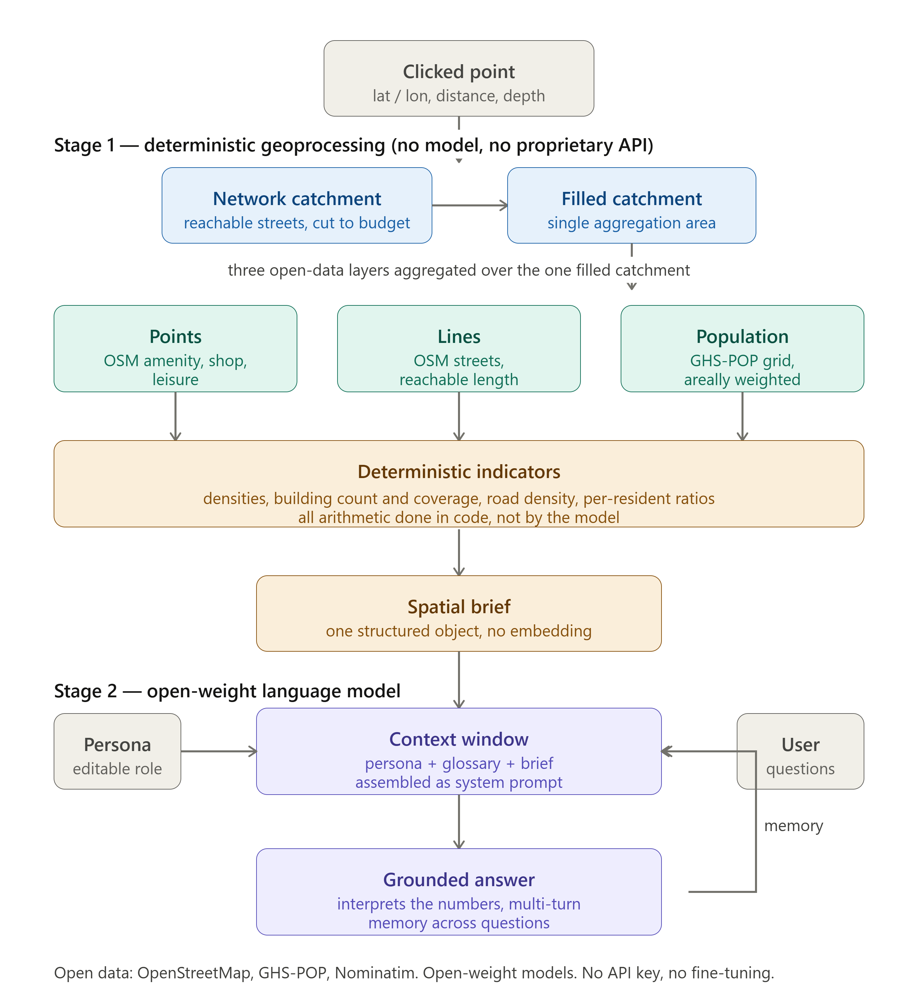
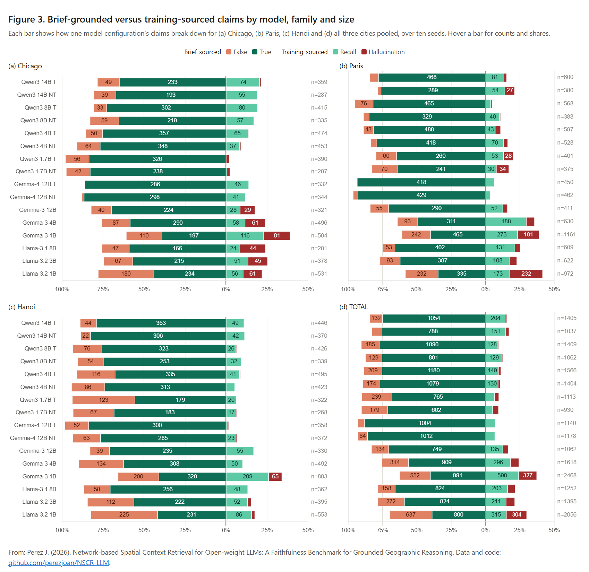
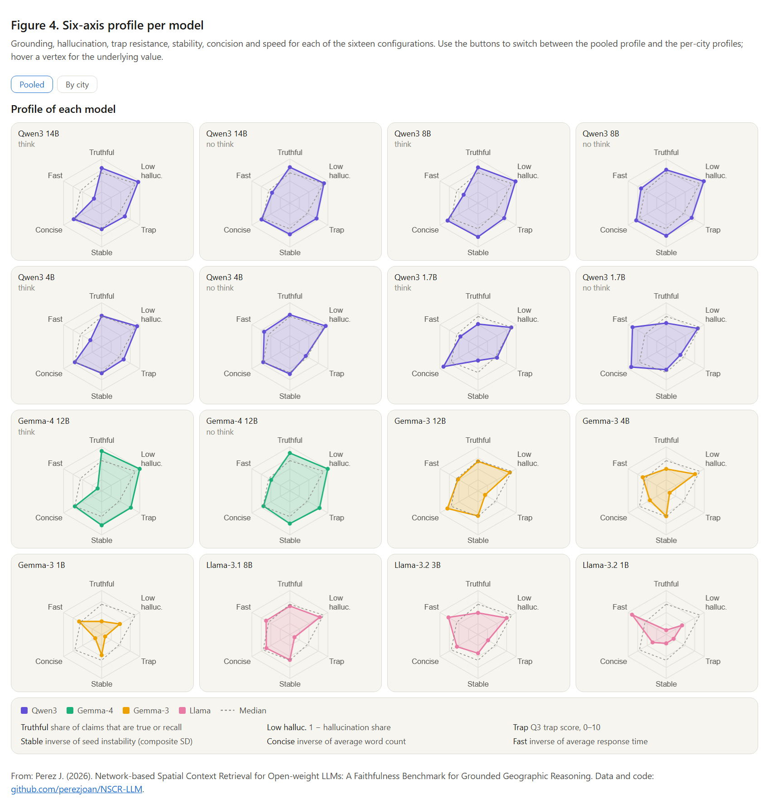
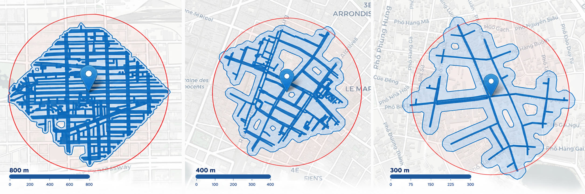

# NSCR-LLM: Network-based Spatial Context Retrieval for Open-weight LLMs

### A Faithfulness Benchmark for Grounded Geographic Reasoning

[](LICENSE)
[](https://orcid.org/0000-0003-3003-0895)
[](https://urbangeoanalytics.com)
[](#citation)

Large language models hold a lot of latent geographic knowledge but reason poorly over
space and are unreliable when queried from coordinates alone. Useful behaviour appears
only when structured spatial context is placed in the prompt. That raises a question
geographic evaluation has left unexamined: once the right context is supplied, does the
model reason from it, or override it with its own recall?

This repository holds the materials for the paper of the same title:

- **An open retrieval pipeline.** A clicked point defines a pedestrian street-network
  catchment (the area actually reachable on foot, not a circle). Features from
  OpenStreetMap and the GHS-POP population grid are retrieved over that catchment,
  reduced in code to a compact set of indicators, and injected into an open-weight
  model as a *spatial brief*. No proprietary service, no fine-tuning.
- **A claim-level faithfulness benchmark.** Every claim a model makes is labelled by
  its source (brief or outside knowledge) and its correctness, giving four categories:
  brief-true, brief-false, recall, hallucination. Each case ends with a planted false
  premise that the brief refutes, scored as trap resistance.
- **The full evaluation corpus.** Sixteen open-weight configurations (Qwen3, Gemma 3,
  Gemma 4, Llama 3.x; 1B to 14B; thinking and non-thinking modes) on three contrasting
  cities, each case resampled over ten seeds: 1,440 responses, about 22,000 labelled
  atomic claims, plus the seed-1 subset double-labelled by a human annotator and a
  language-model judge (2,203 claims, Cohen's kappa 0.685).

The headline result: resistance to the planted premise is set by model family and
generation far more than by parameter count, and it is not a by-product of reading
skill. Several models reproduce the brief faithfully and then abandon it the moment a
confident user contradicts it.



*Figure 1. A clicked point defines a pedestrian network catchment; open data are
retrieved and reduced in code to a compact spatial brief, which is injected into an
open-weight LLM for questioning.*

## Results at a glance

The two result figures of the paper are provided as interactive pages. The previews
below are static; **click a preview to open the interactive version** (hover for counts
and values; Figure 4 switches between pooled and per-city profiles).

[](https://htmlpreview.github.io/?https://github.com/perezjoan/NSCR-LLM/blob/main/results/figures/figure3_claim_composition.html)

*Figure 3. Brief-grounded versus training-sourced claims by model, family and size, for
(a) Chicago, (b) Paris, (c) Hanoi and (d) all three cities pooled.
[Interactive version](https://htmlpreview.github.io/?https://github.com/perezjoan/NSCR-LLM/blob/main/results/figures/figure3_claim_composition.html)*

[](https://htmlpreview.github.io/?https://github.com/perezjoan/NSCR-LLM/blob/main/results/figures/figure4_model_profiles.html)

*Figure 4. Six-axis profile per model: grounding, hallucination, trap resistance,
stability, concision and speed.
[Interactive version](https://htmlpreview.github.io/?https://github.com/perezjoan/NSCR-LLM/blob/main/results/figures/figure4_model_profiles.html)*

The HTML files can also be opened locally from `results/figures/` after cloning.

## Repository layout

```
.
├── README.md                     this file
├── LICENSE                       Apache License 2.0
├── NOTICE                        third-party data and model attributions
├── REPO_METADATA.md              title, GitHub description, topics, release checklist
├── requirements.txt              Python dependencies for the notebook (unpinned)
├── requirements-lock.txt         exact versions used for the paper
├── code/
│   └── network_catchment_demo.ipynb   Stage 1 (catchment + brief), Stage 2 (LLM), Stage 3 (seed runner)
├── briefs/                       frozen inputs
│   ├── chicago_800m.json, paris_400m.json, hanoi_300m.json
│   ├── personas.txt              three personas and their three questions, verbatim
│   └── glossary.md               field glossary injected in every prompt, verbatim
├── benchmark/
│   ├── annotation_guide/         general guide + one guide per city (brief, glossary, persona, case rules)
│   ├── seed1_human_vs_machine/   seed-1 packs, human labels, judge labels, code table, validation
│   ├── runs/<city>/*.jsonl       raw model outputs, one record per response (1,440)
│   ├── claims/<city>/*.txt       responses segmented into atomic claims, unlabelled sheets
│   └── labels/<city>/*.txt       judge labels for all ten seeds (T/F/R/H)
└── results/
    ├── Q3_trap_scores.tsv        per-seed trap score with justification
    ├── seed_instability_*.tsv    per-seed category shares and instability summary
    ├── model_configs_specs.xlsx  Table 1 source (checkpoints, sampling parameters)
    └── figures/                  Figures 1 to 4 (static images and interactive HTML)
```

Every subfolder has its own `README.md` describing file formats.

## The three cases

| Case | Persona | Catchment | Key evidence in the brief | Planted premise (Q3) |
|---|---|---|---|---|
| Chicago, West Side | A, food-access analyst | 800 m | 119 POIs, no supermarket or grocery; 4 convenience, 1 fast food, 1 variety store; 7,128 residents | "supermarkets within an easy walk" |
| Paris, near Le Marais | B, urban mobility planner | 400 m | 26,776 residents/km2, coverage 0.58, 971 POIs across daily-needs categories | "one of the calmer, lower-density corners" |
| Hanoi, Old Quarter | C, urban form researcher | 300 m | 40,545 residents/km2, 1,491 buildings averaging 76 m2, 50 POIs per 1,000 residents | "hardly anyone actually lives here" |

Difficulty rises across the three: Chicago asks the model to notice an absence, Paris
to interpret a number, Hanoi to hold a high resident count against a strong touristic
prior and against the brief's own residential-population caveat. The three briefs were
retrieved and frozen on 25 June 2026.



*Figure 2. The three network catchments, Chicago (800 m), Paris (400 m) and Hanoi
(300 m), as rendered in the selection widget.*

## The model grid

| Family | Checkpoints | Thinking mode | Sampling (T / top-p / top-k) |
|---|---|---|---|
| Qwen3 (Alibaba Cloud) | 1.7B, 4B, 8B, 14B | both | 0.6 / 0.95 / 20 (thinking), 0.7 / 0.8 / 20 (non-thinking) |
| Gemma 4 (Google) | 12B | both | 1.0 / 0.95 / 64 |
| Gemma 3 (Google) | 1B, 4B, 12B | no | 1.0 / 0.95 / 64 |
| Llama 3.2 / 3.1 (Meta) | 1B, 3B / 8B | no | 0.6 / 0.9 / library default |

All models run locally in 4-bit NF4 (double quantisation, bfloat16 compute) with the
vendor-recommended sampling parameters, a 10,000-token generation limit, and fixed seeds
1 to 10. Brief, glossary, persona and questions are identical across models, so the
configuration is the only source of behavioural difference.

## The benchmark in brief

1. **Run.** For each configuration, case and seed, the three questions are asked in one
   conversation with memory. Output: `benchmark/runs/`.
2. **Segment.** Each answer is exhaustively cut into atomic claims, the smallest spans
   making an independently checkable assertion. Questions back to the user and offers
   of further analysis are marked `ECHO` and excluded. Output: `benchmark/claims/`.
3. **Label.** Each claim gets one of four labels against the frozen brief and glossary:

   | | Correct / defensible | Incorrect |
   |---|---|---|
   | **Brief-sourced** | **T** brief-true (grounded) | **F** brief-false (mistake) |
   | **Externally-sourced** | **R** recall | **H** hallucination |

   The brief wins on conflict. Rules and case-specific calls are in
   `benchmark/annotation_guide/`. Output: `benchmark/labels/`.
4. **Score the trap.** Question 3 is scored per seed: 1 if the answer rejects the
   premise and grounds the correction in the brief, 0.5 if it hedges or corrects without
   brief evidence, 0 if it accepts the premise. Summed over ten seeds gives 0 to 10 per
   case. Output: `results/Q3_trap_scores.tsv`.
5. **Aggregate.** Category shares pooled over seeds, trap score, seed instability (mean
   SD of the four shares across seeds), words and seconds per answer. Appendix C of the
   paper tabulates all of it.

**Judge calibration.** Seed 1 of every configuration in every city (2,203 claims) was
labelled independently by a human annotator and by the language-model judge (Claude
Fable 5.1) under the same guide. Pooled agreement is 85.0 percent, Cohen's kappa 0.685,
Krippendorff's alpha 0.684; per-configuration error rates correlate at Spearman 0.96.
The judge then labelled seeds 2 to 10. Files and agreement tables are in
`benchmark/seed1_human_vs_machine/`.

**Exclusions.** Two Paris sequences of Llama-3.2-1B (seeds 1 and 9) hit the generation
cap inside a repetition loop and are excluded from all measures, leaving 1,434 valid
responses. Those records are still present in `benchmark/runs/` with `"truncated": true`.

## Reproducing

```bash
git clone https://github.com/perezjoan/NSCR-LLM.git
cd NSCR-LLM
pip install -r requirements-lock.txt --extra-index-url https://download.pytorch.org/whl/cu128
jupyter lab code/network_catchment_demo.ipynb
```

- **A new brief.** Run Stage 1, click a point, set distance and block depth. Live
  OpenStreetMap and GHS-POP data are retrieved, so the numbers will differ from the
  frozen briefs as the data evolve.
- **The frozen setting.** Paste a brief from `briefs/` into the notebook's load cell,
  load one of the sixteen configurations in Stage 2 (the frozen glossary is the built-in
  default), paste the persona and questions from `briefs/personas.txt` into the Stage 3
  runner, and run seeds 1 to 10. The runner writes the same JSONL records as
  `benchmark/runs/`.
- **The tables.** Every number in Appendix C can be recomputed from `benchmark/labels/`
  (category counts), `results/Q3_trap_scores.tsv` (trap) and
  `results/seed_instability_per_seed_shares.tsv` (instability); response length and time
  come from the `answer` and `gen_seconds` fields in `benchmark/runs/`.

See `code/README.md` for a cell-by-cell description of the notebook. The notebook also
runs unchanged on Google Colab with a GPU runtime, which is how the paper's runs were
made.

## Data sources and licences

Code, documentation, annotation guides, labels and derived tables are released under the
Apache License 2.0. The briefs contain values derived from OpenStreetMap ((c) OpenStreetMap
contributors, ODbL 1.0) and GHS-POP R2023A (European Commission JRC, CC BY 4.0). Model
outputs were generated with Qwen3 (Apache 2.0), Gemma 3 and Gemma 4 (Gemma Terms of Use)
and Llama 3.1/3.2 (Llama Community License); no weights are redistributed. See `NOTICE`.

## Author

**Joan Perez** · [ORCID 0000-0003-3003-0895](https://orcid.org/0000-0003-3003-0895)

[Urban Geo Analytics](https://urbangeoanalytics.com) is an independent research and
consulting practice focused on geospatial modeling, AI for cities, and open-source
urban analytics. 🌐 [urbangeoanalytics.com](https://urbangeoanalytics.com)

## Citation

Until the paper is published, cite the repository:

> Perez, J. (2026). *Network-based Spatial Context Retrieval for Open-weight LLMs: A
> Faithfulness Benchmark for Grounded Geographic Reasoning.* Version 1.0.0.
> https://github.com/perezjoan/NSCR-LLM (Zenodo DOI: TODO)

## Before release (checklist)

- [ ] Create the `v1.0.0` release and paste the Zenodo DOI into this file and
      Section 3.7 of the paper (`[ZENODO-DOI]`, `[RELEASE-TAG]`).
- [ ] Optionally consolidate `benchmark/labels/` into one CSV (the per-file formats are
      heterogeneous; see `benchmark/labels/README.md`).
- [ ] Optionally add Table C1 as a CSV under `results/`.
